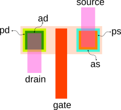
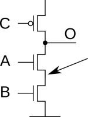
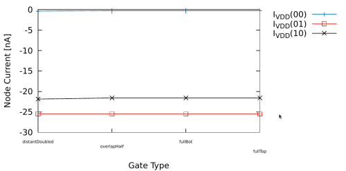
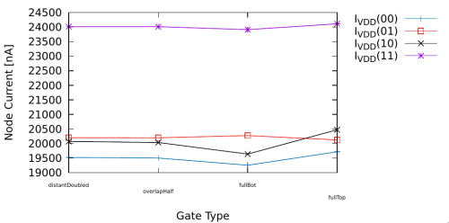

# Model Description -- deprecated !!!

This brief documentation describes model deviations and highlights techniques and model customization employed in this repository.

## Drain/Source Model Areas

For proper simulation, and new models, the AD/AS transistor parameters should be checked and altered by hand (if necessary). PD/PS parameters should be also checked, but their modification should not influence the correctness of the simulation.



  * AD MOS parameter: drain Area
  * AS MOS parameter: source area
  * PD MOS parameter: drain perimeter area
  * PS MOS parameter: source perimeter area

In this project, AD/AS is standardized:
  * if the area of drain or source is shared between two stacked transistors, the AD/AS parameters for the particular transistor are equal to 1/2 of the total AS/AD shared area
  * commonSource/commonDrain parameters should be set to 1, if the transistor belongs to the stacked structure and its drain or source respectively is shared
  * the "psubIn" node should be shared for NMOSes with overlaping Drain/Source
  
  For detailed explanation, see the section below.

### Detailed Explanation for the Model Modifications Related to Serial Transistor Stacks

Serial transistor stack(s) share overlapping common drain/source areas.



The theory - for the subthreshold leakage in the two-transistor NMOS stack - says:
  * when the upper transistor is OFF and the lower transistor is ON, the MOS stack experiences full leakage, because Vds == Vdd
  * when the lower transistor is OFF and the upper transistor is ON, the open MOS leakage is lower, because Vds == Vdd  - Vt
  
For the subthreshold leakage evaluation in TSMC 180nm, see the [simmulation](../tests/test014_nmosSubthresholdLeakage.spice) and [model](../tests/test014_nmosSubthresholdLeakage.gnuplot).
  
The std cell models exported by Magic suffer from drain/source areas mismatch. The areas are exported such a way, that the junction area sum is computed and the resultant area is assigned to one of both stacked transistors; zero is assigned to the second transistor junction area parameter. 

Example of NAND2X1 model snippet exported by Magic:
```
M1000 Y A VDD VDD TSMC180nmP w=2u l=0.2u ad=1.2p pd=5.2u as=2p ps=10u
M1001 VDD B Y VDD TSMC180nmP w=2u l=0.2u ad=0p   pd=0u   as=0p ps=0u

M1002 a_36_24# A VSS VSS TSMC180nmN w=2u l=0.2u ad=0.6p pd=4.6u as=1p ps=5u
M1003 Y B a_36_24# VSS   TSMC180nmN w=2u l=0.2u ad=1p   pd=5u   as=0p ps=0u
```

This is OK from the total area point of view (and parasitics), but it may compromise photocurrent simulation. The NMOS model uses AS/AD parameters as a source for junction area computation. Based on the simulations, AS/AD re-balancing was performed by hand for NAND2X1, NOR2X1 and NAND3X1 models: the area fractions were assigned to correct transistors conserving the summary area. 

In most cases, the area partitions were assigned equally (this is not true just for asymmetric cases -- smaller transistor shares D/S area with a bigger one). It has been shown in [resistantGates/test051](../resistantGates/output/test051.pdf) and [resistantGates/test052](../resistantGates/output/test052.pdf) (see graphs below), that equal assignment is better than other options as it matches the subthreshold leakage theory. The photocurrent for 00 input pattern is the lowest one and the 01 input pattern is a bit higher than 10. Additionally this approach conserves the original (not extended) AS/AD total area.

The simulation output for the transistor stack above (one PMOS -- closed for illumination simulation and open for leakage simmulation -- and two serial NMOSes):

Simulated subthreshold leakage depending on the input pattern:



Simulated photocurrent (300mW laser) depending on the input pattern:



"commonDrain" and "commonSource" parameters were added to enhanced model and to indicate if drain/source is shared or not to enable correct photocurrent simulation: a single transistor under illumination experiences whole AS/AD area (regardless of whether it is shared with it's stack neighbor) during illumination simulation (it is considered, that if the area is shared, the AS/AD parameter for the particular transistor are equal to 1/2 of the total shared AS/AD area). Additionally, the single virtual "psubIN" node was defined for photocurrent simulation in NMOS stacks (common transistors share the "psubIN" node).

Example of NAND2X1 model snippet modified by hand (SUBCKT_PMOS/SUBCKT_NMOS represent the NMOS/PMOS model enriched by laser photocurrent simulation):
```
Xpmos1 Y A VDD VDD VSS LaserTrig SUBCKT_PMOS beamDistance = beamDistanceTop ch_w=2u ch_l=0.2u mos_ad=0.6p mos_pd=2.6u mos_as=1p mos_ps=5u commonDrain = 1
Xpmos2 VDD B Y VDD VSS LaserTrig SUBCKT_PMOS beamDistance = beamDistanceTop ch_w=2u ch_l=0.2u mos_ad=0.6p mos_pd=2.6u mos_as=1p mos_ps=5u commonDrain = 1

Xnmos1 MIDDLE A VSS VSS psubIn LaserTrig SUBCKT_NMOS beamDistance = beamDistanceBot ch_w=2u ch_l=0.2u mos_ad=0.3p mos_pd=4.6u mos_as=1p mos_ps=5u commonDrain = 1 commonSource = 0
Xnmos2 Y B MIDDLE VSS psubIn LaserTrig SUBCKT_NMOS beamDistance = beamDistanceBot ch_w=2u ch_l=0.2u mos_ad=1p mos_pd=5u mos_as=0.3p mos_ps=0u commonDrain = 0 commonSource = 1

* common NMOS substarte virtual node
XpsubIn psubIn VSS PSUB_IN
```
